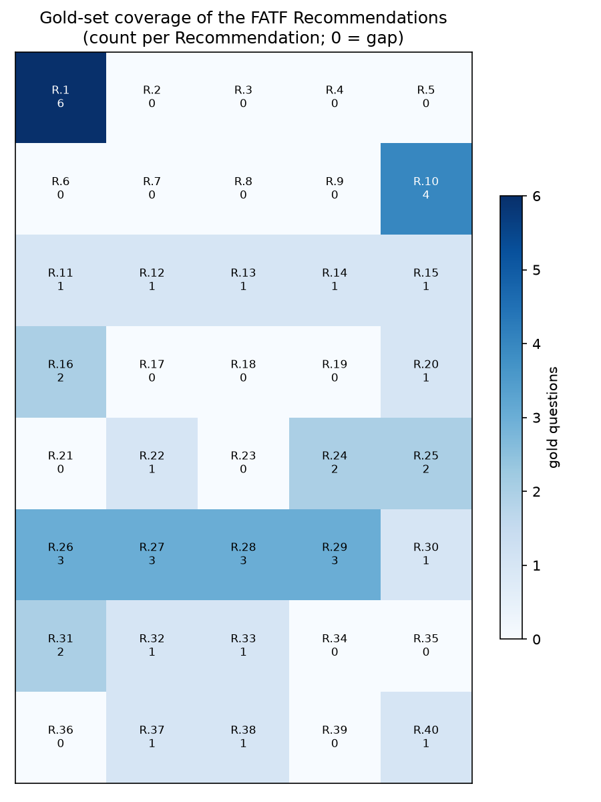

# RegRAG-AML

A small, deployed, and evaluated retrieval-augmented Q&A assistant over a bounded public regulatory corpus: the FATF (Financial Action Task Force) AML/CFT recommendations. It answers questions with inline citations to the source text, abstains when the answer is not in the documents, treats retrieved text as data rather than instructions, and reports real retrieval and answer-quality metrics.

> Live demo: _(link added after deploy)_

## Why this project

Entry and mid-level AI/ML roles ask for shipped RAG systems, evaluation frameworks for generative outputs, and a live deploy. RegRAG-AML is a deliberately small build that produces exactly those three, over a compliance corpus that also fits a financial-crime / regulatory wedge. The faithfulness evaluation and injection-aware guardrails reuse methodology from an MS Business Analytics capstone on prompt-injection defenses.

## Problem / motivation

### What is FATF, and why this corpus

The Financial Action Task Force (FATF) is the intergovernmental body, established by the G7 in 1989, that sets the global standard for combating money laundering, terrorist financing, and the financing of proliferation. Its core output, "The FATF Recommendations" (the 40 Recommendations), is the framework that more than 200 jurisdictions have committed to implement. FATF assesses countries against it through mutual evaluations, and jurisdictions with strategic deficiencies can be placed on its "grey" or "black" lists, which carries real economic and reputational consequences. In practice, the Recommendations shape the AML/CFT obligations that banks and other regulated institutions must meet worldwide.

That makes it an ideal corpus for a grounded question-answering assistant: it is authoritative, public, bounded, and well-structured, and it is exactly the kind of high-stakes regulatory text where a wrong or invented answer is unacceptable. A compliance assistant that hallucinates an obligation, or cites a rule that is not there, is worse than useless.

RegRAG-AML therefore does three things a demo chatbot does not: it answers only from the source text with page citations, it abstains when the documents do not cover a question, and it reports measured retrieval and answer-faithfulness metrics.

Official source: [The FATF Recommendations](https://www.fatf-gafi.org/en/publications/fatfrecommendations/documents/fatf-recommendations.html) and [fatf-gafi.org](https://www.fatf-gafi.org/).

## Approach

```
FATF corpus (PDF)
      |
   extract + chunk
      |
   embed (local sentence-transformers)
      |
   vector store (Chroma)
      |
   retrieve top-k
      |
   LLM answer with inline citations   <- abstain if low relevance
      |                                   <- retrieved text treated as data, not instructions
   answer + citations
```

- Corpus: FATF "The FATF Recommendations" (the 40 Recommendations). One corpus, one embedding model, one vector store. The PDF is pulled from a pinned Internet Archive (Wayback Machine) snapshot and verified by SHA-256, so the corpus is reproducible and independent of FATF's live CDN. FATF publishes no data API; a pinned, checksummed archive snapshot is the more durable source for a static standards document.
- Embeddings: local `sentence-transformers` (no API cost, fully offline for eval).
- Vector store: Chroma (persisted locally).
- Generation: an OpenRouter-hosted model (Llama 3.3 70B by default) behind a provider-agnostic client that also targets Together AI and any OpenAI-compatible endpoint. OpenRouter routing can be pinned to a single upstream provider for reproducible evaluation.
- Faithfulness judge: Anthropic Haiku 4.5 with a versioned rubric.

## Evaluation

The system is scored against a hand-written gold set of 35 questions: 30 answerable (easy, medium, and hard, including multi-Recommendation synthesis), some of them false-premise "refutation" questions the documents can correct, and 5 out-of-scope questions that should be declined. Each answerable item is labeled with its source Recommendation, difficulty, and expected page(s); `expected_pages` include the Recommendation statement and its Interpretive Note where both contain the answer.

Metrics:
- Retrieval: recall@8 (a correct page in the top 8) and MRR, against the expected pages.
- Answer faithfulness: an LLM judge (Haiku 4.5, rubric v1.0) grades whether every claim is grounded in the retrieved sources. This is the primary answer-quality metric, because lexical-overlap metrics penalize correct paraphrase.
- Citations: hit rate (does the answer cite at least one correct page) as the primary signal, with strict page-level recall and precision as secondary.
- Out-of-scope: whether the system declines without fabricating.

Results (35-item gold set; indicative, not a benchmark):

| Metric | Value |
|---|---|
| Retrieval recall@8 | 0.97 |
| Retrieval MRR | 0.62 |
| Answer faithfulness (LLM judge) | 0.82 |
| Citation hit rate | 0.73 |
| Citation recall (strict) | 0.56 |
| Citation precision | 0.34 |
| Out-of-scope handled (no fabrication) | 0.90 |
| False-abstention rate | 0.00 |

Across all 30 answerable questions the judge found zero unfaithful answers, so there were no hallucinations. The faithfulness score below 1.0 reflects minor over-elaboration graded "partial," not invented facts.

Configuration: `bge-small-en-v1.5` embeddings, Llama 3.3 70B (via OpenRouter) generation, Haiku 4.5 judge, k = 8, abstain threshold 0.66 (tuned on the gold set with `tune_threshold.py`).

Gold-set coverage of the corpus (23 of the 40 Recommendations; see the gaps):



Reproduce with `uv run python run_eval.py`, which writes `results/eval_results.json` and `reports/eval_report.md`.

## How to run locally

Dependencies are managed with [uv](https://docs.astral.sh/uv/). `requirements.txt` is generated from the lockfile and is what Streamlit Community Cloud installs on deploy.

```bash
# 1. Create the environment from the lockfile
uv sync

# 2. Configure API keys
cp .env.example .env   # then fill in the keys you need (see .env.example)

# 3. Download the corpus (idempotent; pinned Wayback snapshot, SHA-256 verified)
uv run python download_corpus.py

# 4. Build the vector index
uv run python build_index.py

# 5. Launch the app
uv run streamlit run app.py
```

Ask from the command line instead of the app:

```bash
uv run python ask.py "What must financial institutions do for customer due diligence?"
```

Run the evaluation (writes `results/` and `reports/`):

```bash
uv run python run_eval.py
```

To refresh `requirements.txt` after changing dependencies (the project itself is excluded so the deploy installs only third-party packages):

```bash
uv export --no-hashes --no-dev --no-emit-project -o requirements.txt
```

Prefer plain pip? `python -m venv .venv` then `pip install -r requirements.txt` also works.

## Limitations and next steps

- The gold set is small (35 items) and hand-written. The numbers are indicative, not a benchmark, and per-difficulty breakdowns rest on small counts.
- Coverage is bounded: the gold set touches 23 of the 40 Recommendations (see the heatmap), with gaps including R.6 to R.9, R.17 to R.21, and R.34 to R.36.
- One embedding model, one vector store, no reranking, by design. A production version would add a reranker and compare embedding models.
- The generator occasionally omits an inline citation on very short answers (3 of 30 here), which lowers strict citation recall; citations are matched at the page level, which is harsh when a Recommendation spans several pages, so the hit rate is the fairer read.
- One out-of-scope question (the EU AML definition of customer due diligence) was answered with FATF's definition rather than a clean "not in this document." It did not fabricate, but it conflated two frameworks.
- The faithfulness judge is a single model (Haiku 4.5) with a v1.0 rubric. The next validation step is to hand-label a subset of answers and report judge-versus-human agreement (Cohen's kappa), the same validation used in the capstone this reuses.
- This is not legal or compliance advice. It answers only from one version (October 2025) of one document.

## License

MIT. See [LICENSE](LICENSE).
